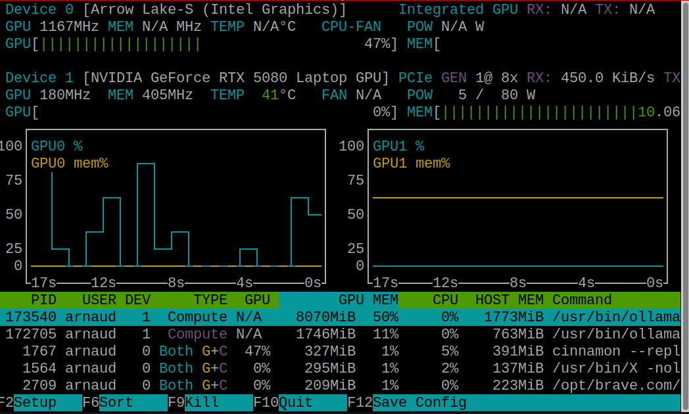

+++
title = "Gestion des doubles GPUs sous Linux"
description = "Tutoriel pour configurer un système dual GPU (Intel iGPU + NVIDIA dGPU) sous Linux. Il explique comment utiliser les variables d'environnement pour prioriser l'iGPU au quotidien et basculer manuellement vers le dGPU, rendant les outils dédiés obsolètes."
date = 2026-03-21
draft = true
tags = ["gpu", "intel", "nvidia", "linux", "gentoo", "offload", "prime"]
+++

Mon ordinateur portable est équipé de deux processurs graphiques (GPU):

Le **iGPU d'Intel (Intel Arrow Lake)** assez puissant pour une utilisation quotidien de mon ordinateur (navigation Internet, lecture de vidéos en 4K, ...),

et le **dGPU NVIDIA (GeForce RTX)** plus puissant que l'iGPU Intel pour faire tourner les applications les plus gourmandes (jeux) mais consommant plus d'énergie 

L'objectif principal est donc de prioriser le iGPU Intel par rapport au dGPU NVidia grâce à la technologie **NVIDIA Prime** et la configuration du **"Offload Mode"** proposée par NVidia.

## Monitoring des GPUs

Avant toute modification, il est nécessaire d'observer l'état des deux CPUs.

On peut vérifier la présence des GPUs via la commande `lspci`:
```bash
$ lspci | grep -i 'vga compatible controller'
00:02.0 VGA compatible controller: Intel Corporation Arrow Lake-S [Intel Graphics] (rev 06)
01:00.0 VGA compatible controller: NVIDIA Corporation GB203M / GN22 [GeForce RTX 5080 Max-Q / Mobile] (rev a1)
```

On peut aussi vérifier le bon chargement des modules du noyau NVidia:
```bash
$ lsmod | grep -E 'nvidia|nvidia_uvm|nvidia_drm'
nvidia_uvm           3059712  16
nvidia_drm            139264  3
nvidia_modeset       2187264  3 nvidia_drm
nvidia              15499264  156 nvidia_uvm,nvidia_modeset
```

Pour voir les programmes utilisant le dGPU, NVidia propose l'outil `nvidia-smi` :
```bash
$ nvidia-smi
...
+-----------------------------------------------------------------------------------------+
| Processes:                                                                              |
|  GPU   GI   CI              PID   Type   Process name                        GPU Memory |
|        ID   ID                                                               Usage      |
|=========================================================================================|
|    0   N/A  N/A            1564      G   /usr/bin/X                                4MiB |
+-----------------------------------------------------------------------------------------+
```

On peut aussi avoir un détail de l'utilisation en temps réél de chacun des GPUs avec la commande `nvtop`


L'état de l'alimentation de chaque des cartes est accessible via les fichiers `/sys/class/drm/card*/device/power_state`. 
```bash
$ cat /sys/class/drm/card*/device/power_state
D0
D3cold
```
L'ordre semble être le même que celui de la commande `lspci`. Pour s'en assurer `cat /sys/class/drm/card*/device/vendor` retourne la liste des fabriquants où la valeur *0x8086* indique Intel et *0x10de* indique NVidia.

Le fichier `power_state` retourne la valeur *D0* lorsque la puce est active, *D3cold* lorsqu'elle est en mode économie.

On peut aussi examiner le fichier `power/runtime_status` pour avoir directement les valeurs *active* ou *suspended*.

On peut aussi voir quel GPU est utilisé les rendus *OpenGL* et *Vulkan* avec les commandes `glxinfo| grep 'OpenGL'` et `vulkaninfo| grep -i driverid`.

Maintenant qu'on peut surveiller les états. Il est temps de passer à la configuration.

## Configuration

Pour que le dGPU Nvidia soit désactivé par défaut, on va utiliser des variables d'environnement. Elles doivent être chargées avant l'interface graphique du système. 

Sous Gentoo, ça passe par la création d'un fichier dans `/etc/env.d`; sur les autres distribution, il faudra surement modifier le fichier `/etc/environment`.

Fichier `/etc/env.d/00suspend-nvidia-gpu`:
```bash
# Use Mesa (Intel GPU) instead of NVidia by default
__NV_PRIME_RENDER_OFFLOAD=0
__NV_PRIME_RENDER_OFFLOAD_PROVIDER=modesetting
__GLX_VENDOR_LIBRARY_NAME=mesa
__EGL_VENDOR_LIBRARY_FILENAMES=/usr/share/glvnd/egl_vendor.d/50_mesa.json
__VK_LAYER_NV_optimus=non_NVIDIA_only
VK_DRIVER_FILES=/usr/share/vulkan/icd.d/intel_icd.x86_64.json
```
Et sous Gentoo, on n'oublie pas de lancer `sudo env-update`.

* **__NV_PRIME_RENDER_OFFLOAD=0** : Désactive l'accélération matérielle NVidia. La valeur 0 force l'utilisation du iGPU,
* **__NV_PRIME_RENDER_OFFLOAD_PROVIDER=modesetting** : Spécifie le driver à utiliser. *modesetting* est celui du noyau et donc du iGPU Intel,
* **_GLX_VENDOR_LIBRARY_NAME=mesa** : Utilise la bibliothèque de rendu GLX d'Intel et non celle de NVidia,
* **__EGL_VENDOR_LIBRARY_FILENAMES=/usr/share/glvnd/egl_vendor.d/50_mesa.json** : Utilise la bibliothèque de rendu EGL d'Intel et non celle de NVidia pour les rendus EGL,
* **__VK_LAYER_NV_optimus=non_NVIDIA_only** : Force le moteur de rendu 3D *Vulkan* à ne pas voir le dGPU Nvidia et donc a voir uniquement le iGPU Intel,
* **VK_DRIVER_FILES=/usr/lib/dri/intel_dri.so** : Utilise la bibliothèque de rendu Vulkan d'Intel et non celle de NVidia pour les rendus Vulkan.

En résumer, on dit pour tout ce qui est 3D, utilise le iGPU d'Intel et non celui de Nvidia.

Après un reboot, on peut vérifier que la configuration est prise en compte.


* Vérification du mode `D3cold` avec `cat /sys/class/drm/card*/device/power_state`
* Vérifcation du moteur de rendu OpenGL avec `glxinfo| grep 'OpenGL'`. On doit voir `OpenGL renderer string: Mesa Intel(R) Graphics (ARL)`.
* Vérification du moteur de rendu Vulkan avec `vulkaninfo| grep -i driverid`. On doit avoir `DRIVER_ID_INTEL_OPEN_SOURCE_MESA`.
* Vérification des processus utilisés par le GPU Nvidia via la commande `nvidia-smi`.

Elle doit afficher uniquement le processus X. Même lorsqu'on lance des applications graphiques.
En effet, on veut pouvoir basculer à la demande sur le dGPU Nvidia. Il est donc nécessaire que le serveur X soit aussi lancé sur ce dernier.

Attention, la commande `nvidia-smi` reveille la carte graphique. Il faut attendre environ 30 secondes avant qu'elle passe de nouveau en mode `D3cold`.

Maintenant qu'à l'initialisation, notre système va utiliser le GPU Intel par défaut, il est temps de voir comment basculer à la demande.

## Bascule à la demande

Pour forcer une application à utiliser le dGPU Nvidia, il suffit de revenir sur les variables d'environnements. Je vous propose d'utiliser l'alias suivant :
`alias nvidia-run='__NV_PRIME_RENDER_OFFLOAD=1 __GLX_VENDOR_LIBRARY_NAME=nvidia __VK_LAYER_NV_optimus=NVIDIA_only __NV_PRIME_RENDER_OFFLOAD_PROVIDER=NVIDIA-G0 VK_DRIVER_FILES=/usr/share/vulkan/icd.d/nvidia_icd.json __EGL_VENDOR_LIBRARY_FILENAMES=/usr/share/glvnd/egl_vendor.d/10_nvidia.json'`

C'est un peu long mais au final, on redéfinit l'ensemble des variables avec les valeurs nécessaires pour NVidia. 

Et on peut l'utiliser pour vérifier que GLX et Vulkan utilise le bon GPU:
```bash
$ nvidia-run glxinfo| grep 'OpenGL'
OpenGL vendor string: NVIDIA Corporation
OpenGL renderer string: NVIDIA GeForce RTX 5080 Laptop GPU/PCIe/SSE2
$ nvidia-run vulkaninfo| grep 'driverID'
driverID = DRIVER_ID_NVIDIA_PROPRIETARY
```

## Conclusion

Après des recherches et quelques essais, la configuration de mon dual GPU n'est pas si évidente à trouver. Cependant, maintenant que tout est prêt, mon système fonctionne parfaitement. Le iGPU Intel gère correctement les applications graphiques au quotidien, et le dGPU Nvidia reste en veille jusqu'à ce que je le sollicite via l'alias `nvidia-run`. Je dois avouer que des outils comme Bumblebee ou Prime-run, autrefois populaires, semblent aujourd'hui superflus. Avec une approche moderne et précise basée sur les variables d'environnement, la gestion des GPU est plus fluide et efficace.

